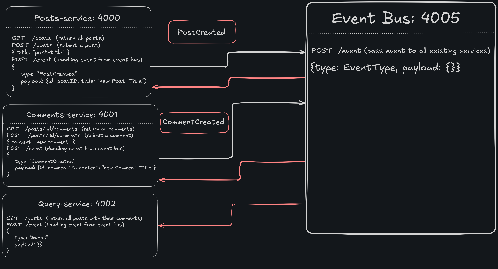

<div align="center">
  <h1>Blog Weave</h1>
  <p>Event-driven microservices demo (Posts + Comments + Query + Event Bus) with a Vite/React client.</p>

  <p>
    
    
    
    
  </p>
</div>

An event-driven microservices demo with:

- `server/posts-service/` — Posts service (Express)
- `server/comments-service/` — Comments service (Express)
- `server/query-service/` — Query service for aggregated data (Express)
- `server/event-bus/` — Event bus for service communication (Express)
- `client/` — React + Vite UI with TanStack Query

Each backend service stores data **in memory** (restarts clear data).

## Prerequisites

- Node.js (this repo works well with modern Node versions; the services run `index.ts` directly)
- Package manager: `pnpm` for all services and client

## Project structure

```
blog-weave/
  client/                    # React + Vite frontend
  server/
    posts-service/           # Posts microservice
    comments-service/        # Comments microservice
    query-service/           # Query service (aggregates posts + comments)
    event-bus/               # Event bus for inter-service communication
  docs/
    architecture/            # Architecture diagrams
```

## Architecture



The system uses an event-driven architecture where:
1. **Posts Service** and **Comments Service** emit events (`PostCreated`, `CommentCreated`) to the **Event Bus**
2. **Event Bus** broadcasts events to all subscribed services
3. **Query Service** listens for events and maintains an aggregated view of posts with their comments
4. **Client** fetches data from the Query Service for optimized reads

## Services

### Posts service (`server/posts-service/`)

- Base URL: `http://localhost:4000`
- Endpoints:
  - `GET /posts` — returns all posts (object keyed by post id)
  - `POST /posts` — creates a post (emits `PostCreated` event)
  - `POST /event` — receives events from event bus

Example:

```bash
curl -X POST http://localhost:4000/posts \
  -H "Content-Type: application/json" \
  -d '{"title":"Hello"}'

curl http://localhost:4000/posts
```

### Comments service (`server/comments-service/`)

- Base URL: `http://localhost:4001`
- Endpoints:
  - `GET /posts/:id/comments` — returns comments for a post
  - `POST /posts/:id/comments` — creates a comment (emits `CommentCreated` event)
  - `POST /event` — receives events from event bus

Example:

```bash
curl -X POST http://localhost:4001/posts/<POST_ID>/comments \
  -H "Content-Type: application/json" \
  -d '{"content":"Nice post"}'

curl http://localhost:4001/posts/<POST_ID>/comments
```

### Query service (`server/query-service/`)

- Base URL: `http://localhost:4002`
- Endpoints:
  - `GET /posts` — returns all posts with their comments (aggregated view)
  - `POST /event` — receives events from event bus

Example:

```bash
curl http://localhost:4002/posts
```

### Event bus (`server/event-bus/`)

- Base URL: `http://localhost:4005`
- Endpoints:
  - `POST /event` — receives events and broadcasts to all services

## Run locally

> You'll want **5 terminals**: one per service + one for the client.

### 1) Start `event-bus`

```bash
cd server/event-bus
pnpm install
pnpm start
```

Runs on `http://localhost:4005`.

### 2) Start `posts-service`

```bash
cd server/posts-service
pnpm install
pnpm start
```

Runs on `http://localhost:4000`.

### 3) Start `comments-service`

```bash
cd server/comments-service
pnpm install
pnpm start
```

Runs on `http://localhost:4001`.

### 4) Start `query-service`

```bash
cd server/query-service
pnpm install
pnpm start
```

Runs on `http://localhost:4002`.

### 5) Start the `client`

```bash
cd client
pnpm install
pnpm dev
```

Vite runs on `http://localhost:5173`.

## Notes

- Data is stored in memory (restarting services resets posts/comments).
- The frontend connects to the Query Service (`http://localhost:4002`) to fetch aggregated posts with comments.
- Start the Event Bus first, then other services, to ensure events are properly routed.
